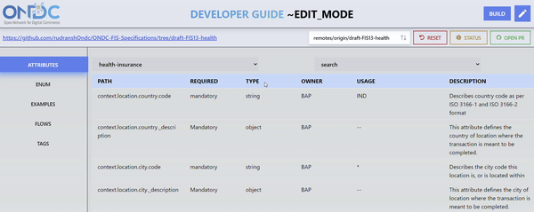
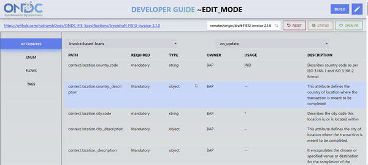

# developer-guide-editor

developer-guide-editor is a comprehensive tool designed to help developers create, manage, and edit development guides with ease. This tool provides a user-friendly interface and various features to enhance the documentation process.

## Features

- **User-Friendly Interface**: Simple and intuitive interface for creating and editing development guides.
- **Edit with Right Click**: Use **right-click** on anything you want to edit in the dev guide.
  
- **Undo Function**: simply press **ctrl + z** to undo upto 5 last actions (EDIT,ADD or DELETE).
- **Component Folder** : Power to create the entire Components folder from scratch.
- **Copy-Paste** : copy the raw payload and then use the **raw** button inside the **add** form to duplicate entire folders or files.

  

## Getting Started

### Prerequisites

Ensure you have the following installed on your machine:

- [Git](https://git-scm.com/)
- [Node.js](https://nodejs.org/)

## Setup Personal Access Token (PAT)

To use this project, you need to generate a GitHub Personal Access Token (PAT) with the required permissions to fork repositories and make pull requests to `official-ondc/specificaions`. Follow these steps to create and configure your PAT:

**Generate a Personal Access Token (PAT):**

- Go to [GitHub's Personal Access Tokens page](https://github.com/settings/tokens).
- Click on the "Generate new token" button.
- Give your token a descriptive name, such as "developer-guide-editor Token".
- Select the following scopes:
  - `repo` (control of private repositories is **NOT** required)
- Click the "Generate token" button at the bottom of the page.
- **Important:** Copy and save the token somewhere secure. You will not be able to see it again once you leave this page.

## Installation

Follow these steps to set up and run the developer-guide-editor project:

1. **Clone the repository:**

   ```sh
   git clone https://github.com/ONDC-Official/developer-guide-editor.git
   ```

2. **Run the backend:**

   - Navigate to the backend directory:
     ```sh
     cd developer-guide-editor/backend-editor/component-modifier
     ```
   - Install the necessary dependencies:
     ```sh
     npm install
     ```
   - Start the backend server:
     ```sh
     npm start
     ```
     The backend server will run on `localhost:1000`.

3. **Run the frontend(in a different terminal):**
   - Navigate to the frontend directory:
     ```sh
     cd developer-guide-editor/frontend-editor
     ```
   - Install the necessary dependencies:
     ```sh
     npm install
     ```
   - Start the frontend server:
     ```sh
     npm run dev
     ```
     The frontend will run on `localhost:5173`.

With these steps, you should have both the frontend and backend servers up and running.

## Contributing

We welcome contributions from the community! To contribute, please follow these steps:

1. Fork the repository.
2. Create a new branch (`git checkout -b feature/your-feature-name`).
3. Make your changes and commit them (`git commit -m 'Add some feature'`).
4. Push to the branch (`git push origin feature/your-feature-name`).
5. Open a Pull Request.

## License

This project is licensed under the MIT License. See the [LICENSE](LICENSE) file for more details.

## Contact

If you have any questions or need further assistance, feel free to open an issue or contact the maintainers.

---

Thank you for using developer-guide-editor! We hope this tool makes your development guide creation process smoother and more efficient.
